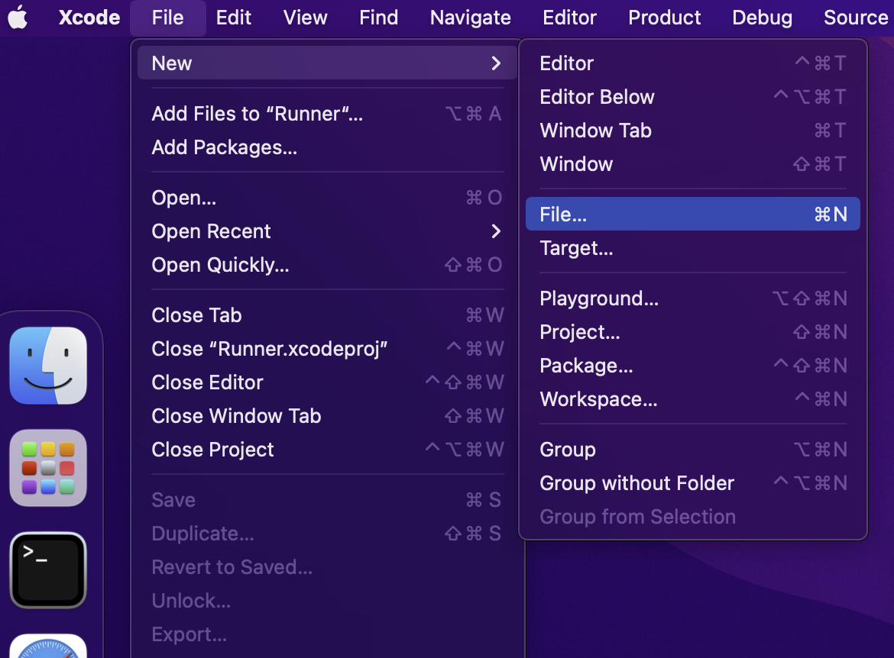
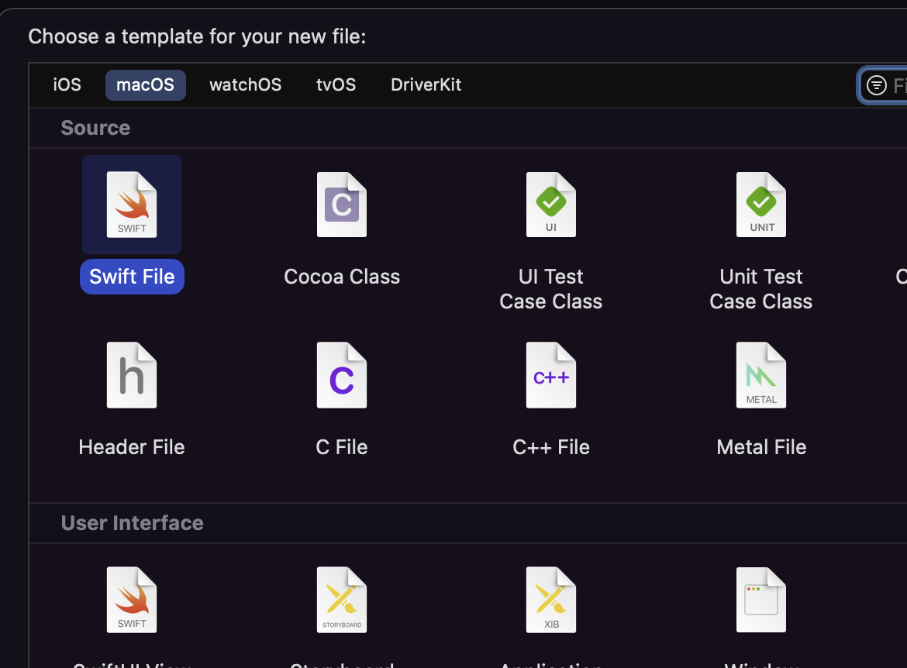
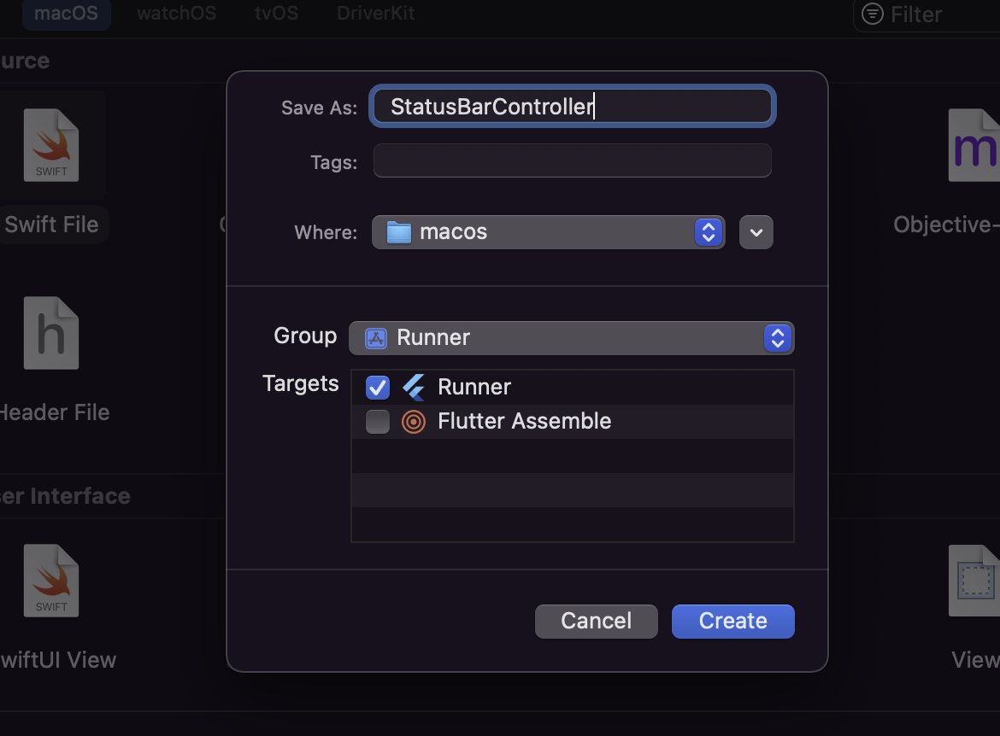
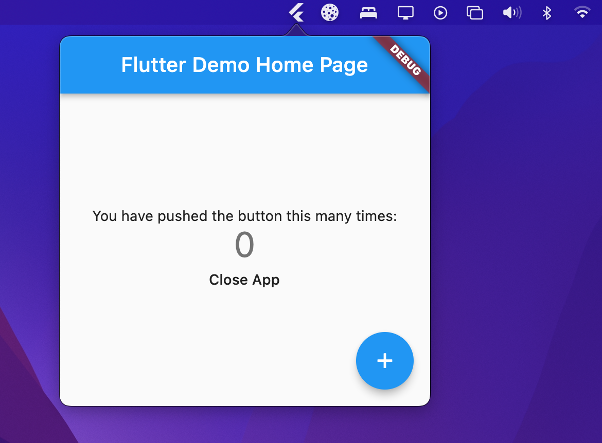

# flutter_macos_menubar_example

starter template for building menubar app in flutter

-------------------------------------------------------
## Getting Started
use this template or follow the following step in your flutter project:

1. Change to Content of macos/Runner/AppDelegate.swift
```[language=swift]
import Cocoa
import FlutterMacOS

@NSApplicationMain
class AppDelegate: FlutterAppDelegate {
  var statusBar: StatusBarController?
  var popover = NSPopover.init()
  override init() {
    popover.behavior = NSPopover.Behavior.transient //to make the popover hide when the user clicks outside of it
  }
  override func applicationShouldTerminateAfterLastWindowClosed(_ sender: NSApplication) -> Bool {
    return false
  }
  override func applicationDidFinishLaunching(_ aNotification: Notification) {
    let controller: FlutterViewController =
      mainFlutterWindow?.contentViewController as! FlutterViewController
    popover.contentSize = NSSize(width: 360, height: 360) //change this to your desired size
    popover.contentViewController = controller //set the content view controller for the popover to flutter view controller
    statusBar = StatusBarController.init(popover)
    mainFlutterWindow.close() //close the default flutter window
    super.applicationDidFinishLaunching(aNotification)
  }
}
```
2. Add a new Swift file named 'StatusBarController.swift' in XCode



3. Add the following code to the StatusBarController.swift
```[language=swift]
import AppKit

class StatusBarController {
    private var statusBar: NSStatusBar
    private var statusItem: NSStatusItem
    private var popover: NSPopover
    
    init(_ popover: NSPopover) {
        self.popover = popover
        statusBar = NSStatusBar.init()
        statusItem = statusBar.statusItem(withLength: 28.0)
        
        if let statusBarButton = statusItem.button {
            statusBarButton.image = #imageLiteral(resourceName: "AppIcon") //change this to your desired image
            statusBarButton.image?.size = NSSize(width: 18.0, height: 18.0)
            statusBarButton.image?.isTemplate = true
            statusBarButton.action = #selector(togglePopover(sender:))
            statusBarButton.target = self
        }
    }
    
    @objc func togglePopover(sender: AnyObject) {
        if(popover.isShown) {
            hidePopover(sender)
        }
        else {
            showPopover(sender)
        }
    }
    
    func showPopover(_ sender: AnyObject) {
        if let statusBarButton = statusItem.button {
            popover.show(relativeTo: statusBarButton.bounds, of: statusBarButton, preferredEdge: NSRectEdge.maxY)
        }
    }
    
    func hidePopover(_ sender: AnyObject) {
        popover.performClose(sender)
    }
}
```
4. Add the following to macos/Runner/Info.plist to hide the dock icon and application menu
```[language=xml]
<key>LSUIElement</key>
<true/>
```
To close the app programmatically, use the following code
```[language=dart]
exit(0)
```
5. Done!
You can now build your menubar app with flutter.

-------------------------------------------------------

This project is a starting point for a Flutter menubar application in macOS.

A few resources to get you started if this is your first Flutter project:

- [Lab: Write your first Flutter app](https://flutter.dev/docs/get-started/codelab)
- [Cookbook: Useful Flutter samples](https://flutter.dev/docs/cookbook)

For help getting started with Flutter, view our
[online documentation](https://flutter.dev/docs), which offers tutorials,
samples, guidance on mobile development, and a full API reference.
